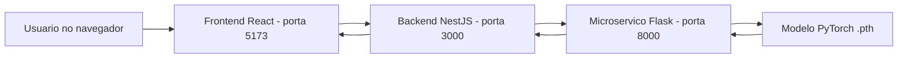

<div align="center">

# ToraxScan AI

Plataforma full stack para classificacao de doencas em radiografias de torax, usando IA para apoiar triagem clinica com retorno de classe prevista e nivel de confianca.


</div>

---

## Sumario

- [Resumo](#resumo)
- [Arquitetura](#arquitetura)
- [Stacks e estrutura](#stacks-e-estrutura)
- [Como rodar localmente com Docker](#como-rodar-localmente-com-docker)
- [Como usar](#como-usar)
- [APIs e documentacao](#apis-e-documentacao)
- [Variaveis de ambiente](#variaveis-de-ambiente)
- [Troubleshooting](#troubleshooting)

---

## Resumo

O ToraxScan AI e um sistema com 3 camadas:

- Frontend web para upload de imagem e exibicao de resultado.
- Backend API para orquestracao da classificacao e health checks.
- Microservico de IA (Flask + PyTorch) para inferencia do modelo.

A aplicacao recebe uma radiografia de torax, executa preprocessamento da imagem, faz inferencia com rede neural e retorna:

- Classe prevista: `Covid`, `Lung_Opacity`, `Normal` ou `Viral_Pneumonia`
- Confianca da predicao em formato numerico

---

## Arquitetura



Fluxo principal:

1. Usuario envia uma imagem no frontend.
2. Frontend faz `POST /classification/analyze` no backend.
3. Backend encaminha a imagem para `POST /predict` no microservico.
4. Microservico preprocessa a imagem, executa inferencia e retorna classe + confianca.
5. Backend devolve o resultado para o frontend.

---

## Stacks e estrutura

### 1) IA microservice (`ai_microservice/src`)

- `main/main.py`: endpoints `POST /predict` e `GET /health`
- `inference/image_handler.py`: preprocessamento (RGB, resize 224x224, normalizacao)
- `inference/predictor.py`: carrega modelo v2 e executa inferencia
- `model/ToraxRadiographyModel.py`: arquitetura da rede neural
- `train/train.py`: pipeline de treino

### 2) Backend (`backend/src`)

- `modules/classification`: endpoint de classificacao com upload multipart
- `modules/system`: health checks do backend e do microservico
- `main.ts`: bootstrap da API, CORS e Swagger em `/docs`

### 3) Frontend (`frontend/src`)

- `pages/home/index.tsx`: fluxo principal da interface
- `components/Dropzone`: upload por clique/drag-and-drop
- `components/Card/ResultCard`: exibicao do diagnostico e confianca
- `api/service/classification.service.ts`: chamada para `/classification/analyze`

---

## Como rodar localmente com Docker

### Pre-requisitos

- Docker Engine instalado
- Docker Compose habilitado (`docker compose`)

### 1) Clonar o repositorio

```bash
git clone <URL_DO_REPOSITORIO>
cd Torax-Radiography-Disease-Classification
```

### 2) Criar arquivos `.env`

Crie os arquivos abaixo a partir dos exemplos:

- `backend/.env`
- `frontend/.env`
- `ai_microservice/.env`

Conteudo sugerido:

```env
# backend/.env
PORT=3000
MICROSERVICE_URL=http://microservice:8000
```

```env
# frontend/.env
VITE_API_URL=http://localhost:3000
```

```env
# ai_microservice/.env
PORT=8000
```

### 3) Build dos containers

```bash
docker compose build
```

### 4) Subir o ambiente

```bash
docker compose up
```

Para rodar em background:

```bash
docker compose up -d
```

### 5) Acessar os servicos

- Frontend: http://localhost:5173
- Backend API: http://localhost:3000
- Swagger (Backend): http://localhost:3000/docs
- Microservico IA: http://localhost:8000
- Flasgger (Microservico): http://localhost:8000/apidocs/

### 6) Parar os containers

```bash
docker compose down
```

Para remover tambem volumes:

```bash
docker compose down -v
```

---

## Como usar

1. Abra o frontend em `http://localhost:5173`.
2. Envie uma radiografia de torax (JPEG/PNG/JPG, ate 10MB).
3. Clique em iniciar analise.
4. Veja no painel:
   - Classe prevista
   - Percentual de confianca
   - Recomendacoes associadas ao resultado

---

## APIs e documentacao

### Backend

- `POST /classification/analyze`
  - Upload: multipart/form-data com campo `image`
  - Retorno: classe e confianca
- `GET /system/health`
  - Status e metricas do backend
- `GET /system/health/microservice`
  - Status do microservico de IA

Documentacao interativa: `http://localhost:3000/docs`

### Microservico de IA

- `POST /predict`
  - Upload: multipart/form-data com campo `image`
  - Retorno: `class_name` e `confidence`
- `GET /health`
  - Status e metricas de processo

Documentacao interativa: `http://localhost:8000/apidocs/`

---

## Variaveis de ambiente

| Servico      | Variavel           | Exemplo                    | Descricao                               |
| ------------ | ------------------ | -------------------------- | --------------------------------------- |
| Backend      | `PORT`             | `3000`                     | Porta da API NestJS                     |
| Backend      | `MICROSERVICE_URL` | `http://microservice:8000` | URL interna para chamar o servico de IA |
| Frontend     | `VITE_API_URL`     | `http://localhost:3000`    | URL base da API consumida no browser    |
| Microservice | `PORT`             | `8000`                     | Porta do Flask                          |

---

## Troubleshooting

### Porta ocupada

Se 5173, 3000 ou 8000 estiverem em uso, encerre processos locais que estejam usando essas portas antes de subir os containers.

### Mudanca de dependencias

Quando alterar dependencias (`package.json` ou `requirements.txt`), execute rebuild:

```bash
docker compose up -d --build
```

### Backend nao consegue falar com microservico

Verifique:

- `MICROSERVICE_URL=http://microservice:8000` no `backend/.env`
- Se o container do microservico esta em execucao
- Logs dos servicos:

```bash
docker compose logs -f backend
docker compose logs -f microservice
```

---

## Estado atual do projeto

- Ambiente de desenvolvimento via Docker Compose com hot reload.
- Backend com Swagger ativo.
- Frontend com fluxo de upload e exibicao de resultado.
- Microservico com inferencia carregando modelo `v2`.
